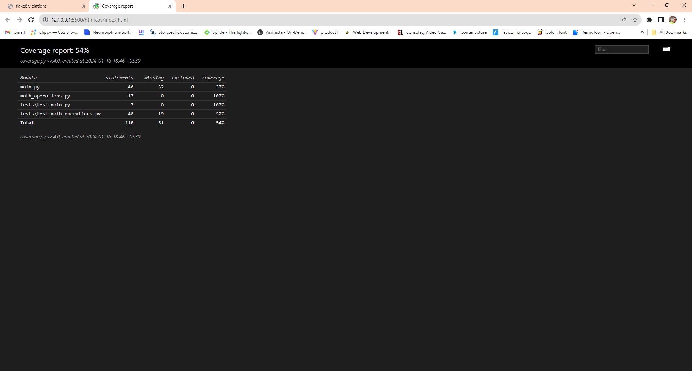
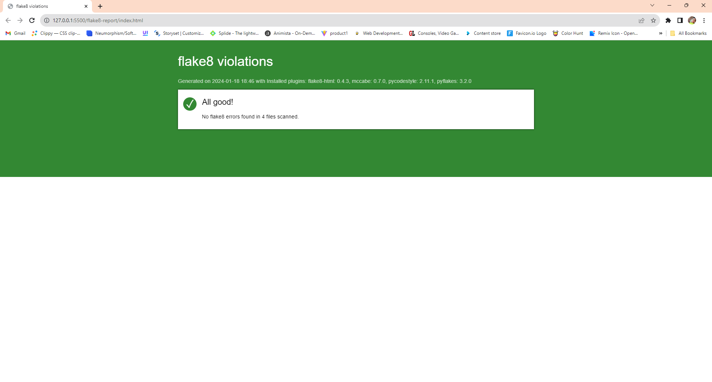
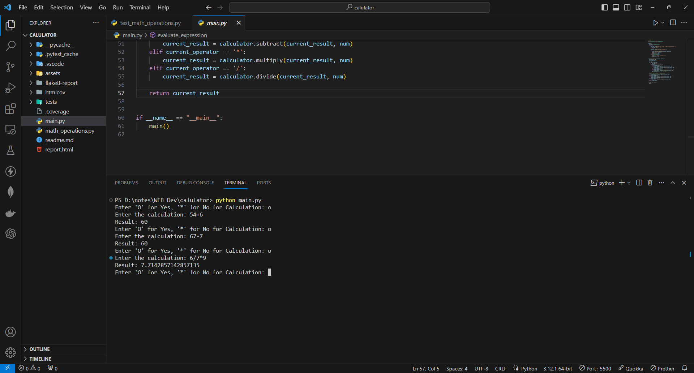

# Project: Tests Unitaires et la Qualité du Code en Python

## Group Members
- Kartik Kartik
- Chetana OLI
- Krishnaraj KONGANAPURAM CHIDAMBARAM
- Alioune badara FALL

## Description du projet
Ce projet se concentre sur la mise en œuvre de tests unitaires et l'amélioration de la qualité du code dans un projet Python. Les outils utilisés comprennent SonarQube, pytest, coverage et Flake8. Le projet comprend une calculatrice simple qui interagit avec l'utilisateur pour effectuer des opérations mathématiques de base.


## Instructions d'installation et d'exécution
1. Clonez ce référentiel sur votre machine locale.
2. Accédez au répertoire du projet.
3. Install the required dependencies:
  ```bash
pip install pytest coverage flake8 pytest-html
```
4. if you want to have pytest-html report
  ```bash
python -m pytest --html=report.html
 ```
5. if you want to have flake8 -html report
  ```bash
python -m flake8 --format=html --htmldir=flake8-report .
 ```
5. if you want to have coverage html report
  ```bash
coverage html
 ```

6. Run the project using the following command:
   ```bash
   python main.py

## Unit Testing and Code Quality
#### Exo 1 : Création de tests pour les opérations de base :
1. Créez une classe MathOperations dans un fichier main.py contenant des méthodes pour 
l'addition, la soustraction, la multiplication et la division.
2. Utilisez pytest pour écrire une suite de tests pour chaque opération, couvrant différents cas 
(entiers, décimaux, négatifs, etc.).
3. Assurez-vous de tester les cas limites et les cas d'erreur.

#### Exo 2 : Ajout de la puissance avec paramétrisation :
1. Ajoutez une méthode power à la classe MathOperations pour le calcul de la puissance.
2. Utilisez pytest avec la paramétrisation pour créer des tests avec différents jeux de données 
afin de vous assurer que la méthode fonctionne correctement.

#### Exo 3 : Amélioration avec le calcul du modulo et rapport HTML :
1. Ajoutez une méthode modulo à la classe MathOperations pour le calcul du modulo.
2. Utilisez pytest avec la paramétrisation pour tester différentes combinaisons de nombres 
pour cette nouvelle méthode.

#### Exo 4 : Fonction main interactive :
1. À la suite de vos fonctions, créez une fonction main qui ne prend aucun argument.
2. Cette méthode demande à l'utilisateur de saisir des éléments à calculer et effectue 
l’opération demandée en utilisant les fonctions précédemment créées.
3. Utilisez pytest avec la paramétrisation pour tester différentes combinaisons d'entrées 
utilisateur.

#### Exercise 5: Evaluating test coverage
- Pytest utilisé pour exécuter des tests et mesurer la couverture des tests.
  ```bash
   coverage run -m pytest -v
  Generated coverage report-html.
  ```

```bash
python -m pytest --html=report.html
```




- A généré un rapport de couverture et l'a intégré à pytest-html.

```bash
coverage html
```


- Vérification des violations de style de code à l'aide de Flake8 et génération d'un rapport HTML

```bash
python -m flake8 --format=html --htmldir=flake8-report .
```



- La Output de la calcul est

```bash
python main.py
```




## Contribuer

Les demandes de tirage sont les bienvenues. Pour les changements majeurs, veuillez d'abord ouvrir un problème

Pour discuter de ce que vous aimeriez changer.

Veuillez vous assurer de mettre à jour les tests le cas échéant.
